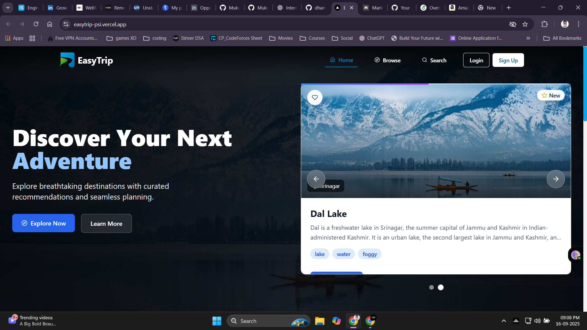
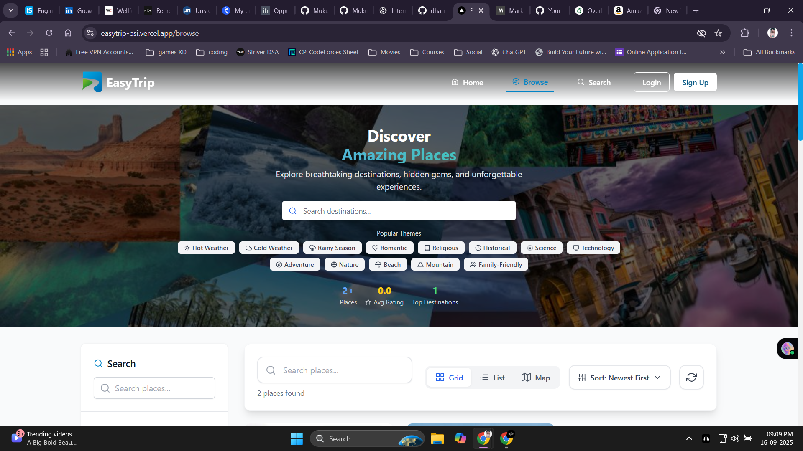
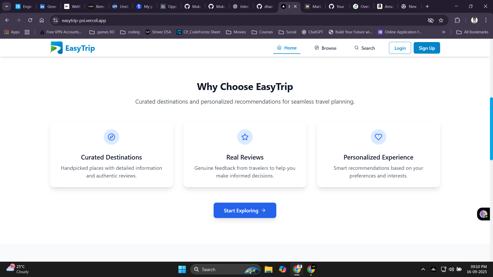
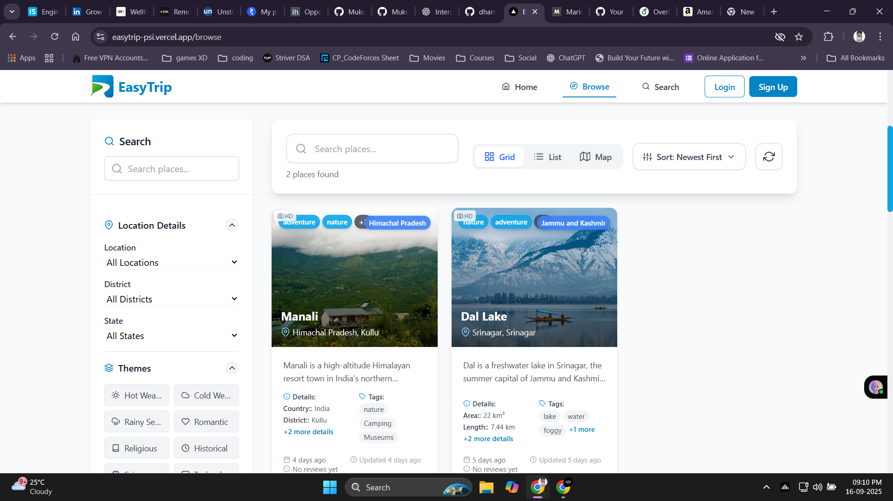
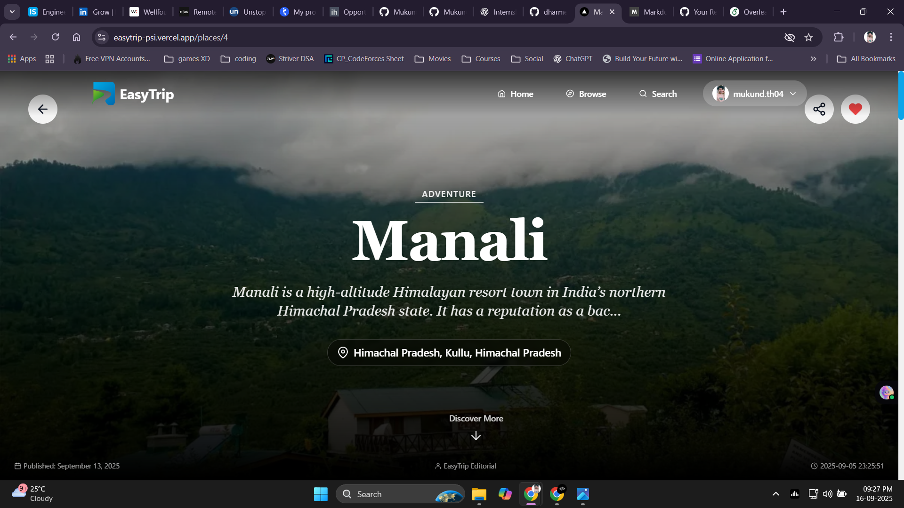
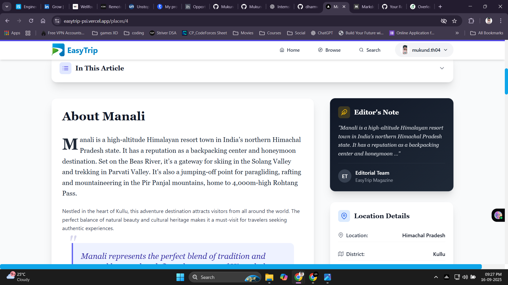
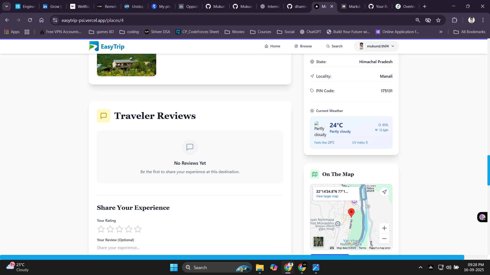

# EasyTrip 🌍 
> Discover Your Next Adventure – A modern travel destination platform built with Next.js, Node.js, and MySQL  (A Full Stack Project)

[](https://nextjs.org/)
[](https://reactjs.org/)
[](https://nodejs.org/)
[](https://expressjs.com/)
[](https://mysql.com/)
[](https://firebase.google.com/)
[](https://tailwindcss.com/)
[](https://cloudinary.com/)

---

## 📸 Project Previews  

> Sneak peek into the EasyTrip experience  

### 🏠 Landing Page (Home Section)  
  

---

### 🌍 Discover Amazing Places (Browse Section)  
  

---

### ✨ Why Choose EasyTrip  
  

---

### 🔎 Search in Browse Section  
  

---

### 🗺️ Checking Out a Tourism Spot (Hero Section)  
  

---

### 📖 Explore About the Place  
  

---

### ☀️ Current Weather Condition & Map Location  
  

---

## 📋 Table of Contents  

- [Overview](#-overview)  
- [Features](#-features)  
- [Technology Stack](#️-technology-stack)  
- [Project Architecture](#-project-architecture)  
- [Environment Variables](#-environment-variables)  
- [Installation & Setup](#-installation--setup)  
- [API Documentation](#-api-documentation)  
- [Deployment](#-deployment)  
- [Contributing](#-contributing)  
- [License](#-license)  
- [Contact](#-contact)  
- [Acknowledgments](#-acknowledgments)  
- [Roadmap](#-roadmap)  

---

## 🌟 Overview  

**EasyTrip** is a modern travel destination discovery platform designed to help users explore breathtaking destinations, read reviews, and plan trips seamlessly. With curated content, rich visuals, and a robust admin panel, it empowers both travelers and admins.  

---

## 🚀 Features  

### ✨ User Features  
- 🏞️ **Destination Discovery** – Browse curated destinations with stunning galleries  
- 🔍 **Advanced Search & Filters** – Explore by location, theme, or rating  
- ⭐ **Ratings & Reviews** – Share and read community feedback  
- 📱 **Responsive Design** – Optimized for all devices  
- 🖼️ **Immersive Galleries** – Magazine-style photo layouts  
- ❤️ **User Profiles** – Save favorites, manage reviews  

### 🛡️ Admin Features  
- 🖊️ **Content Management** – Add, edit, or manage places  
- 📊 **Analytics Dashboard** – Track engagement and popular spots  
- 👥 **User Management** – Monitor users and activity  
- 📝 **Review Moderation** – Ensure authentic feedback  
- 📦 **Image Management** – Cloudinary-based storage & optimization  

---

## 🛠️ Technology Stack  

### 🎨 Frontend  
- **Next.js 13+** - React framework with App Router
- **React 18** - Modern React with hooks and context
- **Tailwind CSS** - Utility-first CSS framework
- **Framer Motion** - Animation library for smooth interactions
- **React Icons** - Comprehensive icon library

### ⚙️ Backend  
- **Node.js** - JavaScript runtime
- **Express.js** - Web application framework
- **MySQL** - Relational database
- **Multer** - File upload middleware
- **CORS** - Cross-origin resource sharing

### 🔐 Auth & Storage  
- **Firebase Auth** - User authentication and management
- **Cloudinary** - Image storage and optimization
- **JWT** - JSON Web Tokens for secure sessions

### 🛠️ Dev Tools  
- **ESLint** - Code linting and formatting
- **PostCSS** - CSS processing
- **Git** - Version control


---

## 🏗️ Project Architecture  

```bash
EasyTrip/
├── backend/              # Node.js + Express API
│   ├── config/           # DB & services
│   ├── controllers/      # Business logic
│   ├── models/           # Database models
│   ├── routes/           # API endpoints
│   ├── services/         # Core services
│   └── utils/            # Middleware & helpers
│
├── frontend/             # Next.js App
│   ├── public/           # Static assets
│   ├── components/       # UI Components
│   ├── pages/            # App routes
│   ├── context/          # Global context
│   ├── hooks/            # Custom hooks
│   └── utils/            # Utilities
````

---

## 🏛️ Architecture Patterns  

> EasyTrip follows modern, scalable, and maintainable architecture principles:  

- 🗂️ **MVC (Model–View–Controller)** – Clean separation of concerns in the backend  
- ⚛️ **Component-Based UI** – Reusable and modular React/Next.js components  
- 🌐 **Context API** – Centralized global state for authentication & user data  
- 🔄 **Custom Hooks** – Abstracted reusable logic for fetching & state management  
- 🔗 **API-First Design** – RESTful endpoints for seamless frontend–backend integration  

---


## 🔧 Installation & Setup

<details>
<summary>▶️ Expand Installation Guide</summary>

---

### Prerequisites

- Node.js (v18.0 or higher)
- MySQL (v8.0 or higher)
- npm or yarn
- Firebase account
- Cloudinary account

---
### Environment Variables

Create `.env.local` files in both frontend and backend directories:

#### Backend (.env)
```bash
# Database Configuration
DB_HOST=localhost
DB_USER=your_mysql_username
DB_PASSWORD=your_mysql_password
DB_NAME=easytrip

# Firebase Admin SDK
FIREBASE_PROJECT_ID=your_firebase_project_id
FIREBASE_PRIVATE_KEY=your_firebase_private_key
FIREBASE_CLIENT_EMAIL=your_firebase_client_email

# Cloudinary Configuration
CLOUDINARY_CLOUD_NAME=your_cloudinary_cloud_name
CLOUDINARY_API_KEY=your_cloudinary_api_key
CLOUDINARY_API_SECRET=your_cloudinary_api_secret

# Server Configuration
PORT=5000
NODE_ENV=development
```
---

#### Frontend (.env.local)
```bash
# API Configuration
NEXT_PUBLIC_API_URL=http://localhost:5000/api

# Firebase Configuration
NEXT_PUBLIC_FIREBASE_API_KEY=your_firebase_api_key
NEXT_PUBLIC_FIREBASE_AUTH_DOMAIN=your_firebase_auth_domain
NEXT_PUBLIC_FIREBASE_PROJECT_ID=your_firebase_project_id
NEXT_PUBLIC_FIREBASE_STORAGE_BUCKET=your_firebase_storage_bucket
NEXT_PUBLIC_FIREBASE_MESSAGING_SENDER_ID=your_firebase_messaging_sender_id
NEXT_PUBLIC_FIREBASE_APP_ID=your_firebase_app_id
```
---

### Database Setup

1. **Create MySQL Database:**
```sql
CREATE DATABASE easytrip;
USE easytrip;
```

2. **Run Database Schema:**
```bash
cd backend
mysql -u your_username -p easytrip < src/config/schema.sql
```

---

### Backend Setup

1. **Install Dependencies:**
```bash
cd backend
npm install
```

2. **Start Development Server:**
```bash
npm run dev
```

The backend will run on `http://localhost:5000`

---

### Frontend Setup

1. **Install Dependencies:**
```bash
cd frontend
npm install
```

2. **Start Development Server:**
```bash
npm run dev
```

The frontend will run on `http://localhost:3000`

---

### Creating Admin User

Run the admin creation script:
```bash
cd backend
node script/make-admin.js
```

---

### Production Environment Variables

Update your environment variables for production:

```bash
# Backend
NODE_ENV=production
DB_HOST=your_production_db_host
API_URL=https://your-domain.com/api

# Frontend
NEXT_PUBLIC_API_URL=https://your-domain.com/api
```

---

### Database Migration

1. **Backup existing data:**
```bash
mysqldump -u username -p easytrip > backup.sql
```

2. **Run production schema:**
```bash
mysql -u username -p production_db < src/config/schema.sql
```

---

### Deployment Steps

1. **Build the application:**
```bash
# Frontend
cd frontend
npm run build

# Backend
cd backend
npm install --production
```

2. **Deploy to your hosting platform:**
   - **Frontend**: Deploy to Vercel, Netlify, or similar
   - **Backend**: Deploy to Railway, Heroku, or VPS
   - **Database**: Use managed MySQL service (AWS RDS, PlanetScale, etc.)

3. **Configure environment variables** in your hosting platform

4. **Set up domain and SSL certificates**

---

## 📚 API Documentation


### Base URL
```
http://localhost:5000/api
```

### Authentication Endpoints

| Method | Endpoint | Description |
|--------|----------|-------------|
| POST | `/auth/login` | User login |
| POST | `/auth/register` | User registration |
| POST | `/auth/logout` | User logout |
| GET | `/auth/profile` | Get user profile |

### Places Endpoints

| Method | Endpoint | Description |
|--------|----------|-------------|
| GET | `/places` | Get all places |
| GET | `/places/:id` | Get place by ID |
| POST | `/places` | Create new place (Admin) |
| PUT | `/places/:id` | Update place (Admin) |
| DELETE | `/places/:id` | Delete place (Admin) |
| GET | `/places/:id/image` | Get place image |

### User Endpoints

| Method | Endpoint | Description |
|--------|----------|-------------|
| GET | `/users/profile` | Get user profile |
| PUT | `/users/profile` | Update user profile |
| GET | `/users/favorites` | Get user favorites |
| POST | `/users/favorites/:id` | Add to favorites |

### Admin Endpoints

| Method | Endpoint | Description |
|--------|----------|-------------|
| GET | `/admin/dashboard` | Admin dashboard data |
| GET | `/admin/users` | Manage users |
| GET | `/admin/places` | Manage places |
| POST | `/admin/places` | Create place |

### Example API Usage

```javascript
// Fetch all places
const response = await fetch('/api/places');
const places = await response.json();

// Create new place (Admin)
const newPlace = {
  name: "Beautiful Destination",
  description: "Amazing place to visit",
  location: "Country, Region",
  tags: ["Nature", "Adventure"]
};

const response = await fetch('/api/places', {
  method: 'POST',
  headers: {
    'Content-Type': 'application/json',
    'Authorization': `Bearer ${token}`
  },
  body: JSON.stringify(newPlace)
});
```
---

</details>


---

## 🚀 Deployment

* **Frontend**: Vercel
* **Backend**: Render
* **Database**: PostgreSQL

---

## 🤝 Contributing

1. Fork the repo
2. Create a new branch: `git checkout -b feature/amazing-feature`
3. Commit changes: `git commit -m "Add amazing feature"`
4. Push branch: `git push origin feature/amazing-feature`
5. Open a Pull Request

---

## 📄 License

Licensed under the **MIT License**. See [LICENSE](LICENSE).

---


## 📞 Contact  

**Project Maintainers**  
👤 Dharmendra — [@dharmendra23101](https://github.com/dharmendra23101)  
👤 Mukund Thakur — [@Mukund934](https://github.com/Mukund934)  


## 🗺️ Roadmap
### Upcoming Features
- [ ] Mobile app (React Native)
- [ ] Trip planning and itinerary builder
- [ ] Social features and user connections
- [ ] Advanced recommendation engine
- [ ] Multi-language support
- [ ] Offline mode support
- [ ] Integration with booking platforms
- [ ] Weather information integration
- [ ] Travel blog and stories feature
- [ ] Augmented reality features

---

✨ *Happy Traveling with EasyTrip!* 🌍✈️


